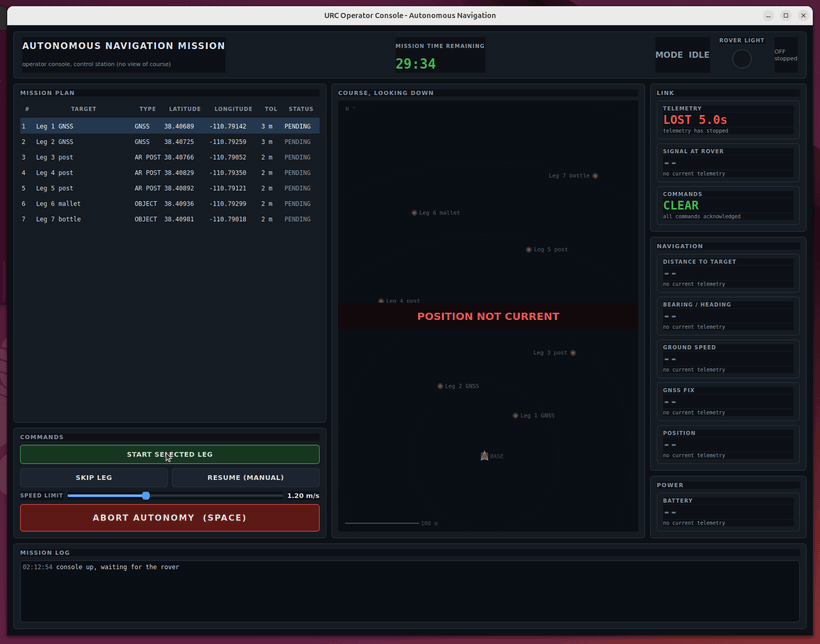

# loop-s2

UMD Loop Challenge Week, software challenge S2. A PyQt operator console that
is a ROS 2 node, built for the URC **Autonomous Navigation Mission**. It
subscribes to live rover telemetry and mission state, and publishes operator
commands back to the rover. ROS 2 Jazzy, Ubuntu 24.04.

[](media/s2-demo.mp4)

A full run at 2x speed: start a leg, drop the speed limit mid-drive, ride out
a link dropout, abort, hand back to manual, and then the rover goes off the
air and the console says so. Click for [the real-time
recording](media/s2-demo.mp4). The clicks are driven by `scripts/record_demo.sh`
so the same run can be reproduced.

## Run it

```bash
mkdir -p ~/loop_ws/src && cd ~/loop_ws/src
git clone https://github.com/benmross/loop-s2.git
cd ~/loop_ws
colcon build --packages-select loop_s2_msgs loop_s2_gui
source install/setup.bash
ros2 launch loop_s2_gui console.launch.py
```

That starts the console and a simulated rover. Useful arguments:

```bash
# force a link dropout for 7 s every 75 s, to see how the console behaves
ros2 launch loop_s2_gui console.launch.py dropout_every_s:=75.0 dropout_duration_s:=7.0
ros2 launch loop_s2_gui console.launch.py dropout_every_s:=0.0    # no forced dropouts
ros2 launch loop_s2_gui console.launch.py rover:=false            # console only, for a real rover
```

Logic tests, no ROS and no display needed:

```bash
python3 -m pytest loop_s2_gui/test
```

## Which mission, and why

The **Autonomous Navigation Mission**: the rover drives itself to a series of
targets, two of them GNSS-only waypoints, three AR-tagged posts and two
unmarked ground objects, with the coordinates getting less exact as the
mission goes on.

It was picked because of one rule in particular. During this mission the
operators sit in the control station with **no view of the course**, and no
human may assist the rover while it is driving itself. That makes an operator
console the whole interface to the mission rather than a convenience: the
screen is the only thing the operator can see, and the only decisions left to
them are mission-level ones. A console for a teleoperated mission competes
with a video feed. This one does not.

Rules source: [URC Requirements & Guidelines](https://urc.marssociety.org/home/requirements-guidelines)
and the [URC Q&A](https://urc.marssociety.org/home/requirements-guidelines/qa).
Cite the section numbers from your own copy of the current rulebook; the 2027
requirements were not published when this was written.

## What the rules changed in the design

- **The LED, mirrored.** The rules require an LED on the back of the rover,
  visible in bright daylight: red for autonomous, blue for teleoperation,
  flashing green on arrival at a target. A judge at the course can see it and
  the operator cannot, so the console shows the same lamp, driven by the same
  field the rover uses to set it. Operator and judge are then looking at one
  signal, not two accounts of it.
- **No driving.** Because no human may help while the rover drives itself,
  there is no steering control anywhere in this GUI. The commands are start a
  leg, skip a leg, cap the speed, abort, and hand back to manual. Abort is the
  biggest control on the screen and is also bound to the space bar.
- **Arrival tolerance is per leg.** The later targets are placed away from the
  coordinates given, so each leg carries its own tolerance and the map draws
  that circle rather than a point. What counts as arrival is a property of the
  leg, and the operator can see it.
- **A mission clock that counts down**, because the mission is scored inside a
  fixed window, and "how long have I got" is the question behind every
  decision to keep waiting or to skip a leg.

## What an operator sees, and what was left out

On screen: mission clock, mode, the rover's signal light, telemetry age, the
signal strength at the rover, unacknowledged commands, distance and bearing to
the active leg against actual heading, ground speed against the limit the
operator set, GNSS fix quality and satellite count, position in both
coordinates and metres from base, battery, the leg table, a plan view of the
course, and a log of every command and every answer.

Left out on purpose:

- **Video.** There is none in this mission, and a black panel where a camera
  should be teaches an operator to ignore that corner of the screen.
- **Per-wheel currents, motor temperatures, IMU rates, CPU load.** They matter
  when something has already gone wrong, and they are for the systems person
  on a second screen. Battery and speed are the two that change what the
  operator does next.
- **Raw GNSS.** Fix type and satellite count answer "can I trust this
  position", which is the operator's actual question. HDOP figures do not.
- **A terminal.** If a thing is worth doing under time pressure it is a
  button.

## When a topic goes silent

Telemetry is best effort at 5 Hz, and every number on screen carries its own
age:

- under 1.5 s, values show normally;
- past 1.5 s, the link tile turns amber and says messages are being missed;
- past 4 s, every telemetry-derived value is **replaced by `--`**, and the map
  greys out and says POSITION NOT CURRENT.

The console never leaves an old number sitting there looking current. A stale
number an operator trusts is worse than a blank one, because they will steer
a decision by it. The failure is loud and it names itself.

Commands are the other half. They go out reliably with a sequence number, and
the console resends anything the rover has not acknowledged, up to three
times, showing the retry count as it goes. If all three go unacknowledged it
says so in red: the rover may not have the command. An operator can then tell
a command that was refused from one that never arrived, which over a radio
link are very different problems.

To watch this happen, the simulated rover drops the link on a schedule
(`dropout_every_s`), and independently of that its signal fades with distance
and terrain, going intermittent below about -95 dBm and silent below -104 dBm.

## If this ran over a real link

The first thing to break is the 5 Hz telemetry stream, and it should: it is
best effort with a queue depth of one, so under loss the console shows fewer,
newer positions rather than a growing backlog of old ones. Next is command
acknowledgement latency, which is why commands are retried rather than fired
once. The mission state message, which carries the whole leg list, is the
expensive one; it is sent at 2 Hz and latched, so a console that reconnects
gets the plan without asking. What would genuinely hurt is adding video to
this link: it would take the bandwidth the telemetry needs and the console
would go blind at exactly the moment the operator needed it.

## Topics

| Topic | Type | Direction | QoS |
|---|---|---|---|
| `/rover/telemetry` | `loop_s2_msgs/RoverTelemetry` | rover to console | best effort, depth 1 |
| `/mission/state` | `loop_s2_msgs/MissionState` | rover to console | reliable, transient local |
| `/operator/command` | `loop_s2_msgs/OperatorCommand` | console to rover | reliable, depth 10 |
| `/operator/command_ack` | `loop_s2_msgs/CommandAck` | rover to console | reliable, depth 10 |

The console does not know it is talking to a simulation. Anything that
publishes these messages will drive it.

## Layout

```
loop_s2_msgs/            the five messages, with the reasoning in the comments
loop_s2_gui/
  loop_s2_gui/console.py     the window and the ROS node behind it
  loop_s2_gui/widgets.py     signal light, status tiles, map, leg table, log
  loop_s2_gui/theme.py       colours and stylesheet
  loop_s2_gui/rover_sim.py   the rover that answers the console
  loop_s2_gui/simulation.py  mission, rover and link model, no ROS or Qt
  config/mission.yaml        the leg list
  test/test_simulation.py    arrival, abort, skip, speed limits, link fade
```

`simulation.py` has no ROS and no Qt in it so the parts worth testing can be
tested: that arrival is detected and flashes green, that an aborted rover
refuses to start a leg until it is resumed, and that the link fades with
distance.
